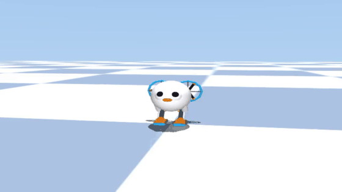

# 🦅 OpenBird-artnfull (Avian-Inspired Bipedal VTOL Robot)

[](https://huggingface.co/spaces/artnfull/OpenBird-artnfull)
[](https://huggingface.co/artnfull/OpenBird-artnfull)
[](https://opensource.org/licenses/Apache-2.0)
[](https://creativecommons.org/licenses/by-nc-sa/4.0/)

> **Physical AI Companion Robot Simulation Platform by artnfull**  
> *True Digitigrade Bipedal Locomotion + 180° Foldable Duct Wing VTOL Flight Simulation (MuJoCo & Python)*

<div align="center">
  
</div>

---

## 🌟 Key Highlights

1. **🦿 True Digitigrade Bipedal Locomotion**
   - Biologically inspired avian legs: Hip $\rightarrow$ Reverse Knee $\rightarrow$ Shin $\rightarrow$ Ankle $\rightarrow$ Round Soles.
   - Dynamic balance stabilization for forward/backward walking and turn-in-place maneuvers.
2. **🪽 Vertical Stowed & 180° Deployed Duct Wings**
   - Folded vertically behind the back during walking; deployed horizontally (180°) for high-efficiency VTOL flight.
   - 4-stage flight FSM: Stand $\rightarrow$ Spool $\rightarrow$ Climb $\rightarrow$ Precision Altitude Hold & Hover.
3. **🦅 Look-Down Eye-Gaze & Beak Pitch Control**
   - Independent eye-gaze and beak pitch control (`neck_pitch`) to look down 60° for ground scanning while keeping wings and body perfectly stable.
4. **📷 Dual Stereo Eye Cameras & Cockpit FPV**
   - Dual eye cameras (`left_eye_cam`, `right_eye_cam`) and center FPV camera (`head_fpv_cam`) for multi-modal vision perception.
5. **🎬 15-Stage Autonomous Cinematic Showcase**
   - Full autonomous demonstration: Bipedal walking $\rightarrow$ Knockdown & Self-Righting $\rightarrow$ Ground Pecking $\rightarrow$ Crouch & Stand $\rightarrow$ VTOL Takeoff $\rightarrow$ 1st-Person Forward Flight $\rightarrow$ 3rd-Person Head Pitch-Down $\rightarrow$ 1st-Person Downward Checkerboard Scan $\rightarrow$ 180° U-Turn $\rightarrow$ Return Flight $\rightarrow$ Soft Touchdown & Wing Stow.

---

## 🎬 15-Stage Cinematic Sequence

| Stage | Action | Description |
| :---: | :--- | :--- |
| **1** | 🚶 **Forward Walk** | Alternating bipedal strides approaching front camera |
| **2** | 🚶 **Backward Walk** | Cautious reverse stepping maintaining origin proximity |
| **3** | 💥 **Knockdown Tumble** | External physical impulse causing dynamic tumble |
| **4** | 🔄 **Self-Righting** | Autonomous dynamic stand-up recovery via reverse-knee recoil |
| **5** | 🌾 **Ground Pecking** | Beak and neck pitch articulation for ground foraging |
| **6** | 🦿 **Crouch & Stand** | Compact knee retraction followed by upright standing |
| **7** | 🪽 **VTOL Takeoff** | 180° wing unfold + 3-blade prop acceleration to 1.0m |
| **8** | 🚀 **3rd-Person Flight** | Forward cruise in mid-air |
| **9** | 👁️ **1st-Person FPV Flight** | Direct cockpit FPV sensing cutting through the air |
| **10** | 🕊️ **3rd-Person Look-Down** | External shot showing head pitching down 60° |
| **11** | 👇 **1st-Person Downward Scan** | Direct sensory scanning of ground checkerboard |
| **12** | 🔄 **1st-Person 180° U-Turn** | Turning back towards home point in 1st-person FPV |
| **13** | 🌐 **3rd-Person Return** | Full external view returning to checkerboard origin |
| **14** | 🕊️ **Stationary Hovering** | Precision pivot hover above home coordinates |
| **15** | 🛬 **Soft Landing & Wing Stow** | Vertical touchdown and stowing wings neatly onto back |

---

## 🎮 Interactive Control Guide

| Key | Action | Description |
| :---: | :---: | :--- |
| `A` / `D` | **Yaw Turn** | Turn left / right (Walking turn / Flight yaw) |
| `↑` / `↓` | **Forward / Backward** | Walk forward/backward or Fly forward/backward |
| `←` / `→` | **Strafe** | Sideways translation in air |
| `R` / `F` | **Altitude** | Altitude Climb (+15cm) / Descend (-15cm) |
| `SPACE` | **Stop / Hover** | Stand still (Ground) / Precision Hover (Air) |
| `1` $\rightarrow$ `2` $\rightarrow$ `3` | **Flight Sequence** | Deploy Wings $\rightarrow$ Takeoff / Hover $\rightarrow$ Land & Fold |
| `C` | **Camera Switch** | 3rd-Person Orbit $\rightarrow$ Head FPV $\rightarrow$ Left Eye $\rightarrow$ Right Eye |
| `V` / `B` | **Eye-Gaze Pitch** | Look down 60° (`V`) / Look forward (`B`) |
| `G` / `Y` / `K` / `P` | **Gestures** | Peck (`G`), Crouch (`Y`), Knockdown (`K`), Auto-Right (`P`) |
| `Q` / `ESC` | **Exit** | Close simulator |

---

## 🚀 Quick Start

### 1. Requirements & Installation

```bash
# Clone repository
git clone https://github.com/artnfull-bot/OpenBird-artnfull.git
cd OpenBird-artnfull

# Install dependencies
pip install mujoco numpy
```

### 2. Launch Simulation

- **Windows One-Click**: Double-click `run_ai_auto.bat` (Autonomous AI) or `run_manual.bat` (Manual Control).
- **Command Line**:
  ```bash
  python run_ai_robot_bird.py  # 15-Stage Cinematic Storyboard
  python run_robot_bird.py     # Interactive Keyboard Flight
  ```

---

## 📁 Repository Structure

```text
OpenBird-artnfull/
├── robot_bird/
│   ├── models/
│   │   └── robot_bird.xml       # MuJoCo 3D physics model
│   ├── controller.py           # 6-DoF flight & bipedal walking kinematics FSM
│   ├── ai_brain.py             # Autonomous behavior demonstration engine
│   └── recorder.py             # Video screen capture utility
├── run_ai_robot_bird.py        # 15-Stage Cinematic Showcase launcher
├── run_robot_bird.py           # Interactive manual flight launcher
├── run_ai_auto.bat             # One-click AI launcher
├── run_manual.bat              # One-click Manual launcher
├── LICENSE                     # Software Apache-2.0 License
├── LICENSE_DESIGN              # Hardware CC BY-NC-SA 4.0 License
└── README.md                   # Project documentation
```

---

## 📜 Licenses
- **Software Code:** [Apache License 2.0](LICENSE)
- **3D Models & Mechanical Designs:** [Creative Commons Attribution-NonCommercial-ShareAlike 4.0 (CC BY-NC-SA 4.0)](LICENSE_DESIGN) (Commercial reproduction prohibited)

---

## ⚠️ Support Policy & Disclaimer

- **Standalone Research Preview:** This project is provided on an **"AS-IS" basis** as an open-source demonstration for the Physical AI & Robotics community.
- **No Individual Technical Support:** The maintainers **do not provide 1-on-1 customer service, individual hardware consulting, or personal troubleshooting**.
- **Issue Tracker Guidelines:** The issue tracker is strictly reserved for critical bug reporting. Questions regarding basic Python setup or personal modifications will be closed without individual response.

---

<details>
<summary><b>🇰🇷 한국어 요약 안내 (Click to expand Korean summary)</b></summary>

<br>

### 🦅 반려 로봇새 (OpenBird-artnfull) 오픈소스 프로젝트 요약

**OpenBird-artnfull**은 조류(Avian)의 골격 구조와 비행 메커니즘에서 영감을 받은 **Physical AI 반려 로봇새 시뮬레이션 플랫폼**입니다.

- **핵심 기술**:
  1. **조류형 역관절 2족보행**: 6-DoF 관절을 통한 역동적인 전/후진 및 제자리 회전 보행.
  2. **180° 수평 전개형 덕트 윙**: 보행 시 등 뒤로 깔끔하게 접히고, 비행 시 180° 수평 전개되는 VTOL 틸트로터.
  3. **독립 하방 60° 시선 제어**: 몸체와 날개의 수평을 유지한 채 머리와 두 눈만 아래로 숙여 지면을 스캔하는 시각 지능.
  4. **15단계 풀 시네마틱 스토리보드**: 보행, 넘어짐/기립, 모이 쪼기, VTOL 이륙, 1인칭 전방 비행, 3인칭 머리 숙임, 1인칭 하방 스캔, 원점 복귀 및 착지.
- **실행 방법**: `run_ai_auto.bat` 또는 `run_ai_robot_bird.py` 실행.
- **라이선스**: 소스코드 Apache 2.0 / 하드웨어 디자인 CC BY-NC-SA 4.0 (상업적 무단 복제 금지).
</details>
